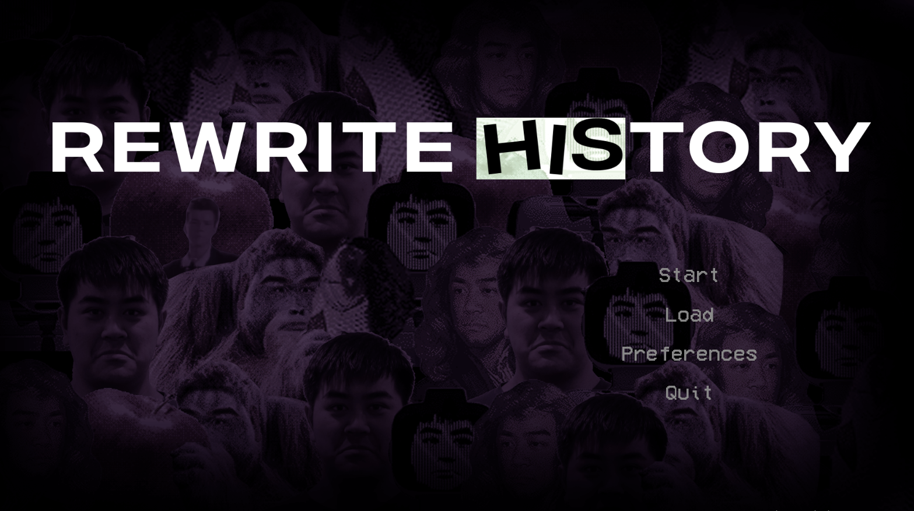
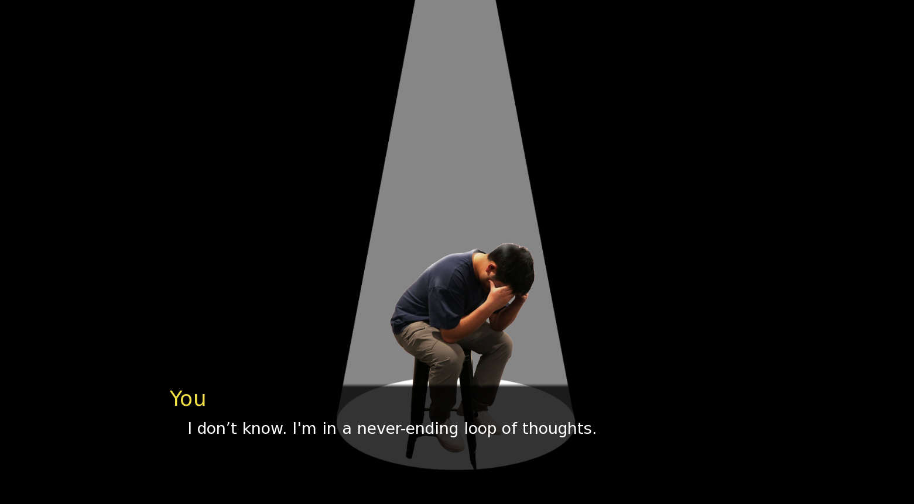
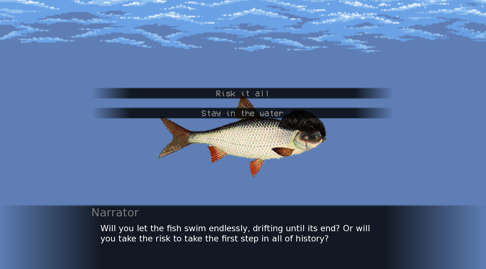

# "Changing History: A Visual Novel Journey"

## Team

The project was created by the following team members:

- **Juan Enrique Jugo**
- **Lachlan Chan**
- **Deven Ranchod**
- **Peter Cheong**
- **Arvindh Kumar Ramachandran**

## Project Overview

This project was developed for the WDCC x SESA Hackathon, where it was awarded the Best Design Award. The team put a fun spin on the theme by playing with the pun "Change His Story," which served as the inspiration for the game. The visual novel explores themes of hope, history, and self-discovery as the protagonist, guided by an all-seeing narrator, travels through time to uncover their ancestors' lives and motivations.

### Theme: "Rewrite History"
The game follows the journey of the narrator and the main player as they discover the power of understanding the past. By traveling through time and learning about their ancestors, the player uncovers reasons for living and hope.

## Game Engine: Ren'Py

The game is programmed using [Ren'Py](https://www.renpy.org/), a popular visual novel engine that allows for easy creation of interactive stories with a focus on narrative and player choices.

### How to Access Ren'Py and Launch the Game:

1. Download Ren'Py from the official website: [Ren'Py Download](https://www.renpy.org/latest.html).
2. Once Ren'Py is installed, open the Ren'Py launcher.
3. To play the game, place this github folder into the "renpy-8.3.4-sdk" folder.
4. Run the game by selecting it from the launcher and pressing "Launch."

## Custom Graphics and Development

All graphics in the game were custom-designed using **Photoshop**. Each sprite, background, and visual element was meticulously crafted to fit the unique narrative and artistic direction of the game. This project showcases the careful attention to detail in design, helping to bring the world and characters to life.

### Screenshots

A glimpse into the world we've crafted.

  
*Exploring the past with the guidance of the mysterious narrator.*

  
*Finding a reason for hope with the help the narrator.*

  
*Discovering ancestral ties and uncovering hidden truths.*

---

## Scene Organization

To ensure a smooth workflow, each "scene" in the game is separated into its own file, making the code more modular and easier to navigate. These scene files can be found inside the `game` folder. Each file contains the dialogue, choices, and transitions specific to its scene, allowing for flexibility and ease of editing.

## Final Notes

Thank you for exploring our project. We hope you enjoy the journey through time and the lessons on hope and history. 